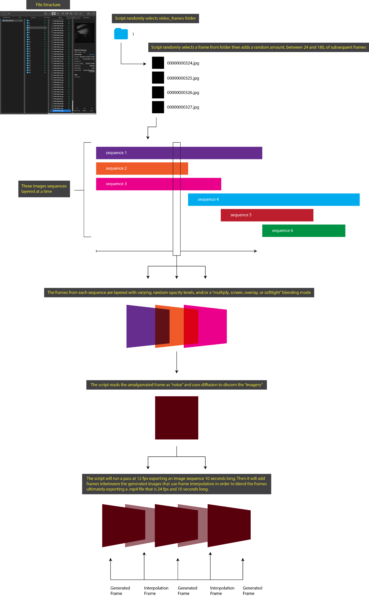

# Generative Video Compiler

A randomised temporal collage engine for video art. It samples contiguous runs of
frames from a library of found footage, layers three parallel streams, blends
them, and cross-dissolves the result into a doubled-rate image sequence.

It produced the short film **[Taken Pictures](https://jstownsend.com/artwork)**
(2024, 6m 33s).



---

## What it actually does

Three "drawers", each holding 360 frames. Each drawer is filled with
**containers** — contiguous runs of 10 to 75 frames, taken from a random starting
point in a random folder of the source library, spilling into another folder when
a run comes up short. Every container is assigned a random blend mode and a random
opacity between 30% and 70%.

The three drawers are then composited frame-against-frame — drawer 1 with drawer 2,
that result with drawer 3 — and each blended frame is cross-dissolved with the next
to double the frame count.

No generative model touches a pixel. Everything you see is found footage,
recombined.

---

## How it was made

I don't write Python.

The method was designed as a document, not as code — a file cabinet with three
drawers, containers of random size, images inheriting their container's opacity
and blend mode. When plain description failed to get the idea across, I drew it:
[`documentation/video-diffusion-amalgamation-script-flow-diagram.pdf`](documentation/video-diffusion-amalgamation-script-flow-diagram.pdf).
That diagram is what finally made the system legible to a machine, and the script
in `scripts/generative_video_compiler_2024.py` is what came back.

The interesting part is what happened next.

---

## What it was supposed to do, and didn't

Reading the 2024 script back in 2026 — two years after the film was finished and
shown — turned up four gaps between the design and the implementation:

| specified | actual |
|---|---|
| Random blend mode per container: multiply / screen / overlay / soft-light | **Only `multiply`.** The mode was assigned, printed to the console, and never read |
| Random opacity, 30–70% | Assigned, printed, **never applied** |
| Blended frames analysed by InceptionV3 to recognise figures, architecture, landscape | The model **loads**, every frame is preprocessed for it, and `predict()` is **never called**. The pass does nothing, 360 times |
| Compiles a video | It doesn't. `subprocess` is imported but unused; the last step renames files into a folder. Assembly happened by hand |

The first two are why every export came out dark.

Multiply always darkens, and here it ran three layers deep at full strength with
no opacity to soften it. For three mid-range source frames:

```
what ran:        0.45 × 0.50 × 0.55  →   32/255     (~12% grey)
what was asked:  random mode @ ~50%  →  ~121/255    (normal exposure)
```

Roughly four times darker than intended. For the entire life of the project, every
output was pulled back up by hand with curves in Premiere — correcting, without
knowing it, for two lines of code that never ran. You couldn't tell what the
machine had made until you lit it yourself.

I found this out in 2026, while documenting the piece for my website.

---

## The two scripts

**`scripts/generative_video_compiler_2024.py`** — the original, preserved exactly
as it ran, bugs included. This is the one that made *Taken Pictures*. Its errors
are the reason the film looks the way it does, so it should not be corrected.

**`scripts/generative_video_compiler_2026.py`** — a working revision. It applies
the blend modes and opacities as originally specified, drops the dead recognition
pass (and with it the TensorFlow dependency), takes its paths as arguments,
accepts a seed so a run can be reproduced, and compiles the video if `ffmpeg` is
on your PATH.

The two make different images. That's the point of keeping both.

---

## Running the 2026 version

```bash
pip install pillow numpy tqdm

python scripts/generative_video_compiler_2026.py \
  --frames-dir /path/to/your/frames \
  --output ./output \
  --frames 360 \
  --fps 24 \
  --seed 7
```

`--frames-dir` is searched recursively; each subfolder is treated as one
continuous source, so runs sampled from it stay temporally contiguous. Frames
inherit the source resolution unless you pass `--size 1024x576`. Pass `--seed` to
make a run repeatable, `--no-video` to stop at the image sequence.

The 2024 script needs TensorFlow, OpenCV and hardcoded absolute paths. It is here
to be read, not run.

---

## Repository

```
scripts/         the two versions
documentation/   the original design documents and flow diagrams, as written in 2024
```

The design documents are unedited. They describe the system as intended, which is
not in every respect the system that exists — that gap is the subject above.

---

*Jeff Townsend — [jstownsend.com](https://jstownsend.com)*
