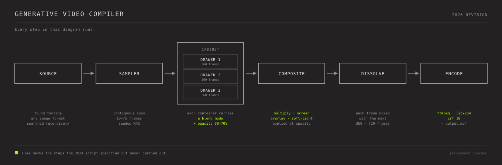

# Generative Video Compiler

A randomised temporal collage engine for video art. It samples contiguous runs of
frames from a library of found footage, layers three parallel streams, blends them
with random modes and opacities, and cross-dissolves the result into a doubled-rate
image sequence.

No generative model touches a pixel. Everything you see is found footage, recombined.



---

## Install

```bash
pip install pillow numpy tqdm
```

`ffmpeg` on your PATH is optional. Without it you still get the full image sequence.

## Run

```bash
python scripts/generative_video_compiler_2026.py \
  --frames-dir /path/to/your/frames \
  --output ./output \
  --frames 360 \
  --fps 24 \
  --seed 7
```

`--frames-dir` is searched recursively, and **each subfolder is treated as one
continuous source**, so runs sampled from it stay temporally contiguous. Point it at a
folder of folders, one per clip.

## Options

| flag | default | |
|---|---|---|
| `--frames-dir` | *required* | source frames, searched recursively |
| `--output` | `./output` | where to write |
| `--frames` | `360` | frames per drawer |
| `--drawers` | `3` | parallel streams to blend |
| `--fps` | `24` | output frame rate |
| `--size` | source size | force a resolution, e.g. `1024x576` |
| `--seed` | — | seed the RNG so a run can be repeated exactly |
| `--no-video` | — | stop after the image sequence |

Output lands in `blended/`, then `final_sequence/`, then `output.mp4`.

---

## Where this came from

This started in 2023 as a method, not a program. I don't write Python. I described a
file cabinet with three drawers, containers of random size, images inheriting their
container's blend mode and opacity — and when describing it in words failed, I drew it:
[`video-diffusion-amalgamation-script-flow-diagram.pdf`](documentation/video-diffusion-amalgamation-script-flow-diagram.pdf).
That drawing is what finally made the system legible to a machine, and
`scripts/generative_video_compiler_2024.py` is what came back.

It made the short film **[Taken Pictures](https://jstownsend.com/artwork)** (2024, 6m 33s).

Reading that script again in 2026 turned up four gaps between the design and the build:

| specified | built |
|---|---|
| Random blend mode per container — multiply / screen / overlay / soft-light | **Only `multiply`.** The mode was assigned, printed to the console, and never read |
| Random opacity, 30–70% | Assigned, printed, **never applied** |
| Diffusion — the blended frame read as noise, resolved back into imagery | **Never written.** An InceptionV3 recognition pass appeared in its place, and `predict()` was never called. The pass does nothing, 360 times |
| Compiles a video | It doesn't. `subprocess` is imported but unused; the last step places image sequences in a folder |

The first two are why every export came out dark. Multiply always darkens, and here it
ran three layers deep at full strength with no opacity to soften it:

```
built      0.45 × 0.50 × 0.55           →   32/255    (~12% grey)
specified  random mode @ ~50% opacity   →  ~121/255   (normal exposure)
```

Roughly four times darker than intended. For the whole life of the project every output
was pulled back up with curves in Premiere — correcting, without knowing it, for two
lines of code that never ran.

**The full account is on my site: [jstownsend.com/gvc](https://jstownsend.com/gvc)**

## The 2024 original

`scripts/generative_video_compiler_2024.py` is preserved exactly as it ran, bugs
included. It is the one that made *Taken Pictures*, and its errors are the reason the
film looks the way it does, so it should not be corrected.

It needs TensorFlow, OpenCV and hardcoded absolute paths. It is here to be read rather
than run — though if you want the images the broken version made, that is the file that
makes them.

## The build logs

`documentation/2023-build-logs/aider.chat.history.md` is the verbatim transcript of the
sessions in which the script was written — eight sessions between 11 November and 26
December 2023, using GPT-4 through [aider](https://aider.chat) v0.17.

It is unedited. It records the project under its earlier name, *Lost and Looking*, when
it was still an attempt at a GAN, and it contains every wrong turn and misunderstanding
on the way to the script that shipped. Read alongside the section above, it is the other
half of the account: the specification, the conversation, and the gap between what was
asked for and what was built.

## Repository

```
scripts/           the two versions
documentation/     the 2024 design documents and flow diagrams, unedited
  2023-build-logs/ the sessions in which the script was written
```

The design documents describe the system as intended, which is not in every respect the
system that exists. That gap is the subject above.

---

*Jeff Townsend — [jstownsend.com](https://jstownsend.com)*
